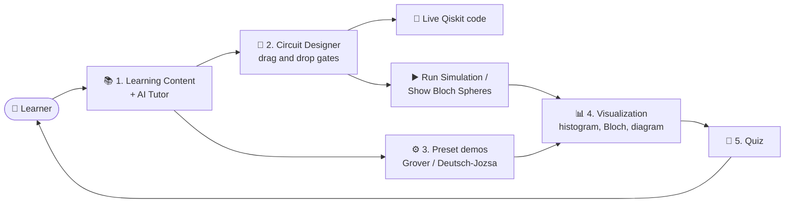
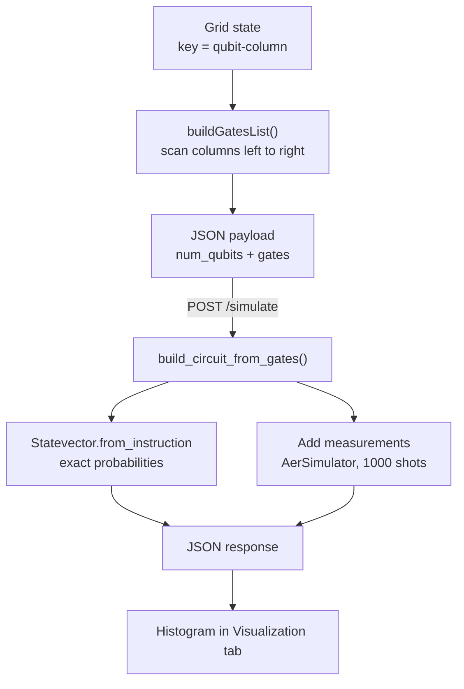
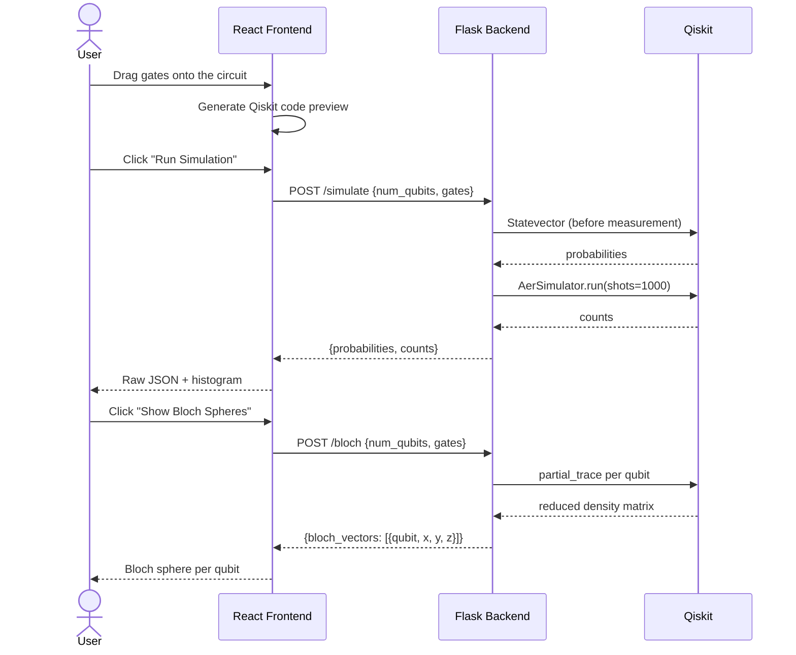
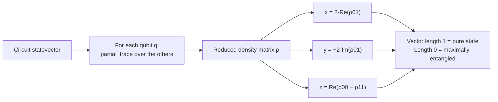
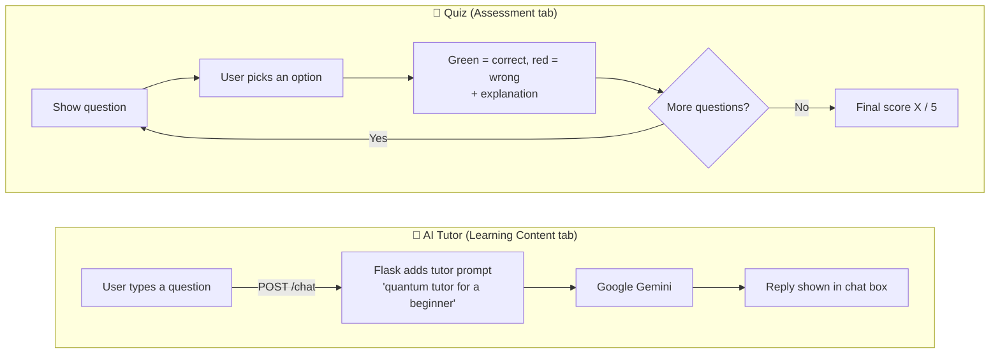
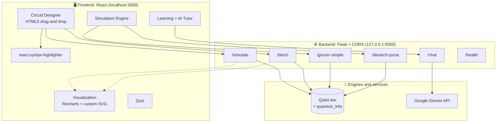

# ⚛️ ResQbit – Quantum Learning Platform

> An AI-based interactive quantum algorithm learning platform, built for **SIH25140**.

Learn quantum computing by *doing*: drag gates onto a circuit, get the Qiskit code generated live, simulate it on Qiskit Aer, and explore the results as histograms, Bloch spheres and circuit diagrams. Read the lessons, ask the AI tutor, and test yourself with a quiz.


---

## 📑 Table of Contents

- [Features](#-features)
- [Screenshots](#-screenshots)
- [How It Works](#-how-it-works)
- [Architecture](#-architecture)
- [API Reference](#-api-reference)
- [Tech Stack](#-tech-stack)
- [Getting Started](#-getting-started)
- [Usage Guide](#-usage-guide)
- [Project Structure](#-project-structure)
- [Current Limitations & Roadmap](#-current-limitations--roadmap)
- [Contributing](#-contributing)

---

## ✨ Features

The app is organised into six tabs:

| # | Module | What it does |
|---|---|---|
| 1 | **Learning Content** | Short lessons on qubits, superposition, entanglement, Grover's and Deutsch-Jozsa, plus the **AI Tutor** chat box (Google Gemini) |
| 2 | **Circuit Designer** | Drag-and-drop builder for **1, 2 or 3 qubits** (6 time steps) with **H, X, Z, CNOT** gates and **auto-generated, syntax-highlighted Qiskit code** |
| 3 | **Simulation Engine** | Preset demos: **Grover's Algorithm**, **Deutsch-Jozsa (constant)** and **Deutsch-Jozsa (balanced)**, with raw JSON results from Qiskit Aer |
| 4 | **Visualization** | **Measurement histogram** (Recharts), **Bloch sphere** view (X-Z plane) and an SVG **circuit diagram** |
| 5 | **Assessment** | 5-question quiz with instant right/wrong feedback, explanations and a final score |
| 6 | **Platform** | Overview of the tech stack and deployment status |

---

## 📸 Screenshots

### 2. Quantum Circuit Designer
Choose 1–3 qubits, drag **H / X / Z / CNOT** onto the grid, and the matching Qiskit code appears below. This example applies `H` on q0, `X` on q1, then a `CNOT` (control q0, target q1). Click a placed gate to remove it.


### 3. Multi-Framework Simulation Engine
Run the preset algorithm demos and inspect the raw output from the Flask/Qiskit Aer backend. Here, the circuit gives roughly 50/50 counts for `10` and `01` over 1000 shots.


### 4. Quantum State & Result Visualization
Measurement outcomes are plotted as a histogram, next to the Bloch sphere view.


### Bloch Spheres & Circuit Diagram
Each qubit's state is drawn in the X-Z plane, with the circuit rendered as an SVG diagram underneath.


> **Why are both Bloch vectors at the centre (`x: 0, y: 0, z: 0`)?** After the `CNOT`, the two qubits are entangled. Each qubit on its own is then in a *maximally mixed* state, which sits at the centre of the Bloch sphere. This is the correct result, not a bug.

---

## 🔄 How It Works

### User journey



### From the drag-and-drop grid to a simulation

The designer stores gates in a grid keyed by `qubit-column`. When you run a circuit, the grid is scanned column by column and flattened into a gate list that the backend rebuilds into a Qiskit circuit.



### Simulation request lifecycle



### Bloch vector calculation



### AI tutor and quiz



---

## 🏗️ Architecture



---

## 🔌 API Reference

Base URL: `http://127.0.0.1:5000`

| Method | Endpoint | Request body | Response |
|---|---|---|---|
| `GET` | `/health` | none | `{"status": "ok"}` |
| `POST` | `/simulate` | `{"num_qubits": 2, "gates": [...]}` | `{"probabilities": {...}, "counts": {...}}` |
| `POST` | `/bloch` | `{"num_qubits": 2, "gates": [...]}` | `{"bloch_vectors": [{"qubit", "x", "y", "z"}]}` |
| `POST` | `/grover-simple` | `{"target": "11"}` | `{"counts": {...}, "target": "11"}` |
| `POST` | `/deutsch-jozsa` | `{"is_constant": true}` | `{"counts": {...}, "oracle_type": "constant"}` |
| `POST` | `/chat` | `{"message": "What is superposition?"}` | `{"reply": "..."}` |

**Gate format** used by `/simulate` and `/bloch`:

```json
{
  "num_qubits": 2,
  "gates": [
    { "gate": "h",  "qubit": 0 },
    { "gate": "x",  "qubit": 1 },
    { "gate": "cx", "control": 0, "target": 1 }
  ]
}
```

Supported gate names: `h`, `x`, `z`, `cx`.

**Try it from the terminal:**

```bash
curl -X POST http://127.0.0.1:5000/simulate \
  -H "Content-Type: application/json" \
  -d '{"num_qubits":2,"gates":[{"gate":"h","qubit":0},{"gate":"cx","control":0,"target":1}]}'
```

---

## 🧰 Tech Stack

| Layer | Technology |
|---|---|
| Frontend | React 19 (Create React App), Recharts, react-syntax-highlighter |
| Backend | Flask, Flask-CORS, python-dotenv |
| Quantum | Qiskit, Qiskit Aer (`AerSimulator`, `Statevector`, `partial_trace`) |
| AI | Google Gemini API (`google-genai`) |

---

## 🚀 Getting Started

### Prerequisites

- Python 3.9+
- Node.js 18+ and npm
- A [Google Gemini API key](https://aistudio.google.com/app/apikey)

### 1. Clone the repository

```bash
git clone https://github.com/ragaamrutha-rap/ResQbit_CtoQ.git
cd ResQbit_CtoQ
```

### 2. Set up the backend

```bash
cd backend
python -m venv venv
source venv/bin/activate          # Windows: venv\Scripts\activate
pip install flask flask-cors qiskit qiskit-aer google-genai python-dotenv
```

Create a file named `.env` inside `backend/` (it is already git-ignored):

```env
GEMINI_API_KEY=your-api-key-here
```

Start the server:

```bash
python app.py
```

The API runs on **http://127.0.0.1:5000**. Check it with `curl http://127.0.0.1:5000/health`.

> Optional: `python test.py` runs a quick Qiskit Aer sanity check (a Bell-state circuit) without starting the server.

### 3. Set up the frontend

In a second terminal:

```bash
cd frontend
npm install
npm start
```

Open **http://localhost:3000**.

> The frontend calls the backend at `http://127.0.0.1:5000`, so start the backend first.

---

## 📖 Usage Guide

1. **Learn:** read the concepts in tab 1 and ask the AI tutor anything (for example, "What is superposition?").
2. **Design:** in tab 2, pick 1, 2 or 3 qubits and drag **H**, **X**, **Z** or **CNOT** onto the grid. For CNOT, the cell you drop on is the *control*; you'll be asked for the *target* qubit number.
3. **Edit:** click a placed gate to remove it, or use **Clear Circuit**.
4. **Simulate:** click **Run Simulation** and/or **Show Bloch Spheres**. Or open tab 3 and run a preset algorithm.
5. **Visualize:** open tab 4 to see the histogram, Bloch spheres and circuit diagram.
6. **Test yourself:** take the quiz in tab 5.

### Example circuit from the screenshots

```python
from qiskit import QuantumCircuit

qc = QuantumCircuit(2, 2)
qc.h(0)
qc.x(1)
qc.cx(0, 1)
qc.measure(range(2), range(2))
```

Qiskit prints bitstrings with qubit 0 on the right, so the two outcomes are `01` and `10`, each with probability 0.5 (for example 503 / 497 over 1000 shots).

### Preset algorithms

| Demo | Circuit | Expected result |
|---|---|---|
| **Grover's (2 qubits)** | Superposition → oracle → diffusion | The marked state `11` dominates the counts |
| **Deutsch-Jozsa (constant)** | Oracle without CNOT | Qubit 0 measures `0` every time |
| **Deutsch-Jozsa (balanced)** | Oracle with CNOT | Qubit 0 measures `1` every time |

---

## 📂 Project Structure

```
ResQbit_CtoQ/
├── backend/
│   ├── app.py            # Flask API: simulation, Bloch vectors, presets, Gemini chat
│   └── test.py           # Standalone Qiskit Aer Bell-state sanity check
├── frontend/
│   ├── public/           # CRA static assets
│   ├── src/
│   │   ├── App.js        # All six modules, circuit designer, charts, quiz
│   │   ├── App.css
│   │   └── index.js
│   └── package.json
├── docs/
│   └── screenshots/      # Images used in this README
├── .gitignore
└── README.md
```

---

## 🗺️ Current Limitations & Roadmap

This is a **local development prototype**. Known limitations, and where it could go next:

- [ ] **Multi-framework backends:** only Qiskit Aer is implemented today; PennyLane, Cirq and qBraid are planned
- [ ] **User authentication and progress tracking:** quiz scores are not saved between sessions
- [ ] **Cloud deployment:** containerise Flask (Render, Railway) and host the built React app (Vercel, Netlify)
- [ ] **Configurable API URL:** the frontend currently hard-codes `http://127.0.0.1:5000`
- [ ] **More gates:** currently H, X, Z and CNOT only, on up to 3 qubits and 6 time steps
- [ ] **Generalised Grover:** the demo is a fixed 2-qubit circuit that searches for `11`
- [ ] **Full 3D Bloch sphere:** the view shows the X-Z projection only
- [ ] **Error handling:** show friendly messages when the backend or Gemini API is unreachable

---

## 🤝 Contributing

1. Fork the repo
2. Create a branch: `git checkout -b feature/my-feature`
3. Commit: `git commit -m "Add my feature"`
4. Push and open a Pull Request

---

## 📄 License

No license has been specified yet. Consider adding one (for example MIT).

---

<p align="center">Built for <b>SIH25140</b> · Quantum learning made interactive ⚛️</p>
